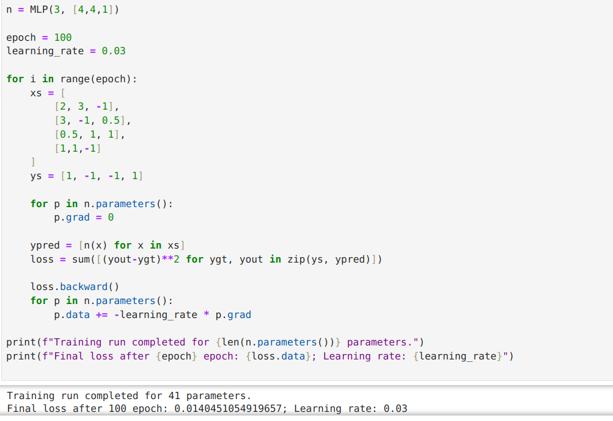

# Simplegrad 

## Introduction

This project is an autograd engine inspired by Andrej Karpathy's educational series ["Neural Network Zero to Hero"](https://www.youtube.com/watch?v=VMj-3S1tku0&list=PLAqhIrjkxbuWI23v9cThsA9GvCAUhRvKZ). 

`simplegrad` contains just enough functionality to train a neural network. It implements autograd functionality along with backpropagation. We can then use these functions to train a neural network as follows:

